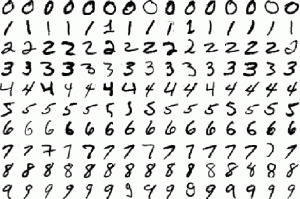

# Handwritten_DigitRecognition

- Recognising Handwritten Digits with MNSIT dataset
- This is my submission in [Kaggle](https://www.kaggle.com/c/digit-recognizer) compition on Digit recognizer
- Got training accuracy of 97% and test accuracy 0f ~98.5% (ran for 30 epochs)
